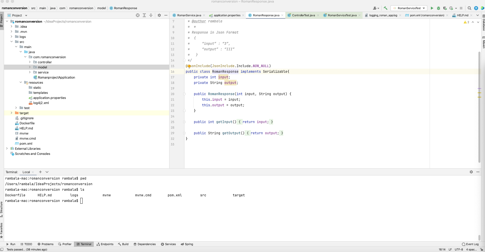
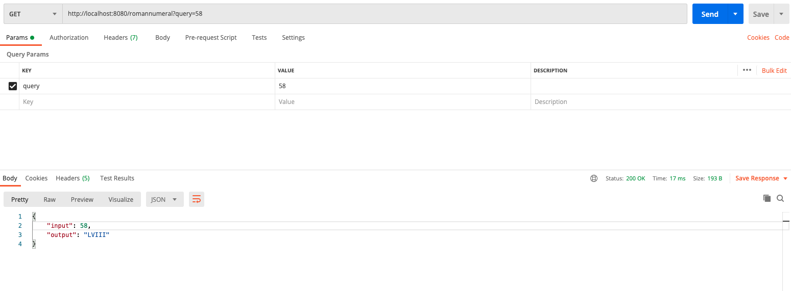
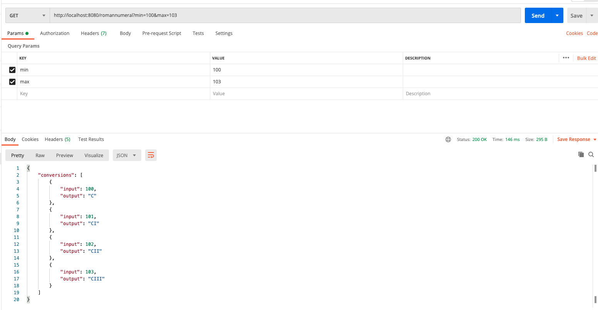
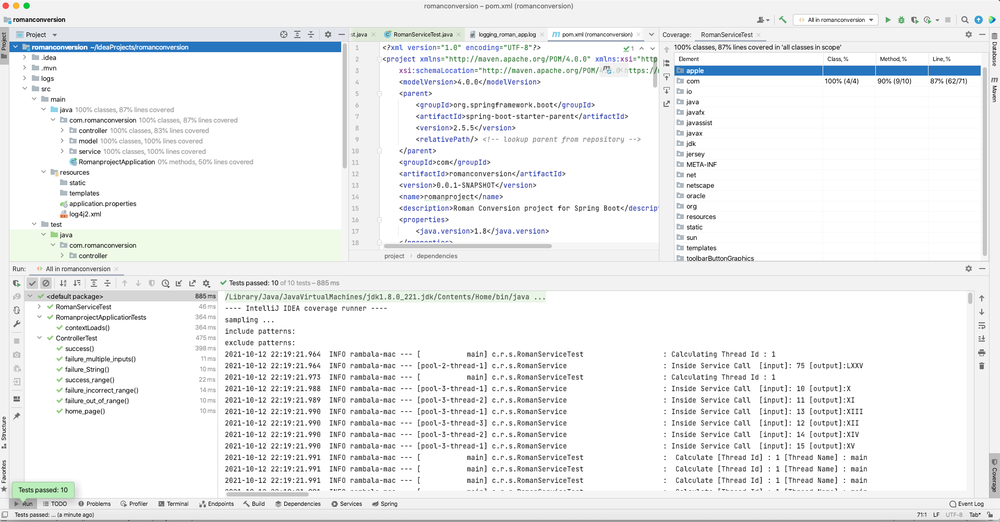
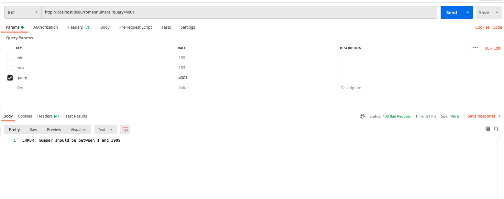

# README Guide for Roman Conversion Project
>Developed by Ram Kumar Balasubramani

**DESCRIPTION**

This project is build on Spring REST API for converting integer number to its equivalent Roman Number.

Sample Rest Endpoint and results.
````
 1) 
 Request: http://localhost:8080/romannumeral?query?=10
 Response : 
        { 
            “input” : “1”, “output” : “X” 
        }
        
 2)
 Request : http://localhost:8080/romannumeral?min=1&max=3
 Response: 
        {
            “conversions”:[
                            { “input” : “1”, “output” : “I” },
                            { “input” : “2”, “output” : “II” },
                            { “input” : “3”, “output” : “III” }
                          ]
         }
    
    
````

##PROJECT PRE-REQUISTES

Based on the operating System, download and install the following softwares

* Java 1.8 or greater (https://www.java.com/en/download/)
* Intellji (https://www.jetbrains.com/idea/download/#section=mac)
* maven 3 or greater (https://maven.apache.org/download.cgi)
* git (https://git-scm.com/downloads)*
* Port **8080** is used by this application. Please make sure this port is NOT currently used.

**Set Class path for these softwares and verify each of the commands are successfull**
````
java -version
mvn -v
git --version
```` 


### Build & Installation Instructions for Local setup

1. Download the project from github directory 
```
git clone 

cd romanconversion
```
2. Open Intellji -> Open -> Select romanconversion and load the project.
   
3. Open Terminal within Intellji and navigate to the downloaded project folder

4. Run Maven Build to generate the maven artifacts.
```
rambala-mac:romanconversion rambala$ pwd
/Users/rambala/IdeaProjects/romanconversion
rambala-mac:romanconversion rambala$ mvn clean install

run "mvn clean install"   

Running above command would result in BUILD SUCCESS message as below.

[INFO] --- maven-install-plugin:2.5.2:install (default-install) @ romanconversion ---
[INFO] Installing /Users/rambala/IdeaProjects/romanconversion/target/romanconversion-0.0.1-SNAPSHOT.jar to /Users/rambala/.m2/repository/com/romanconversion/0.0.1-SNAPSHOT/romanconversion-0.0.1-SNAPSHOT.jar
[INFO] Installing /Users/rambala/IdeaProjects/romanconversion/pom.xml to /Users/rambala/.m2/repository/com/romanconversion/0.0.1-SNAPSHOT/romanconversion-0.0.1-SNAPSHOT.pom
[INFO] ------------------------------------------------------------------------
[INFO] BUILD SUCCESS
[INFO] ------------------------------------------------------------------------
[INFO] Total time:  9.328 s
[INFO] Finished at: 2021-10-12T21:12:40-06:00
[INFO] ------------------------------------------------------------------------
rambala-mac:romanconversion rambala$ 

```
5. Now you can start the application by using "./mvnw spring-boot:run" in the terminal. Maven Wrapper takes care of the dependecies required for the project and you would see a below message on successfull load.
The application is now currently listening on port 8080. 
```
rambala-mac:romanconversion rambala$ pwd
/Users/rambala/IdeaProjects/romanconversion
rambala-mac:romanconversion rambala$ ./mvnw spring-boot:run

[INFO] <<< spring-boot-maven-plugin:2.5.5:run (default-cli) < test-compile @ romanconversion <<<
[INFO] 
[INFO] 
[INFO] --- spring-boot-maven-plugin:2.5.5:run (default-cli) @ romanconversion ---
[INFO] Attaching agents: []

  .   ____          _            __ _ _
 /\\ / ___'_ __ _ _(_)_ __  __ _ \ \ \ \
( ( )\___ | '_ | '_| | '_ \/ _` | \ \ \ \
 \\/  ___)| |_)| | | | | || (_| |  ) ) ) )
  '  |____| .__|_| |_|_| |_\__, | / / / /
 =========|_|==============|___/=/_/_/_/
 :: Spring Boot ::                (v2.5.5)


```
6. Now goto browser or postman and execute below commands to verify if the application is running.

````
http://localhost:8080/
Welcome Roman Conversion !!!

http://localhost:8080/actuator/health

{"status":"UP"}

````

### Testing
You can either use browser or POSTMAN tool for validating the response

1. Test Case for single number
>http://localhost:8080/romannumeral?query=58


> 
2. Test Case for number range between 1 to 3999
>http://localhost:8080/actuator/shutdown?min=100&max=103
 


3. Testing Code Coverage is more than **80%**
   
4. Application is executed with Junit Test cases covering Unit and Integration Testing
   
5. For Testing Parallel execution of the application, use higher range in the validation
> http://localhost:8080/romannumeral?min=10&max=25

### Error Handling
1. Incorrect Requst are handled and returns bad request for appropriate cases


2. If input Number is given out of range
````
http://localhost:8080/romannumeral?query=4001

HTTP/1.1 400 Bad Request
ERROR: number should be between 1 and 3999
````

3. Incorrect input range
````
http://localhost:8080/romannumeral?min=20&max=15

HTTP/1.1 400 Bad Request
Content-Type: text/plain;charset=UTF-8
Content-Length: 50
Date: Wed, 13 Oct 2021 05:31:07 GMT
Connection: close
Minium Number should be Lesser than Maximum Number
````
### Logging

* log4j is used for generating logs and its rotated frequently.

* Check **log4j2.xml** for configuration.

* log file location: 
    ````
    rambala-mac:logs rambala$ pwd
    /Users/rambala/IdeaProjects/romanconversion/logs
    rambala-mac:logs rambala$ ls
    logging_roman_app.log
    rambala-mac:logs rambala$ 
    ````


* log information for **Parallel** Execution:
    ````
    2021-10-12 22:48:41.674  INFO rambala-mac --- [nio-8080-exec-2] c.r.c.RomanController                    : Range Method...
    2021-10-12 22:48:41.676  INFO rambala-mac --- [pool-8-thread-2] c.r.s.RomanService                       : Inside Service Call  [input]: 11 [output]:XI
    2021-10-12 22:48:41.676  INFO rambala-mac --- [pool-8-thread-3] c.r.s.RomanService                       : Inside Service Call  [input]: 12 [output]:XII
    2021-10-12 22:48:41.676  INFO rambala-mac --- [pool-8-thread-1] c.r.s.RomanService                       : Inside Service Call  [input]: 10 [output]:X
    2021-10-12 22:48:41.677  INFO rambala-mac --- [nio-8080-exec-2] c.r.c.RomanController                    :  Calculate [Thread Id] : 25 [Thread Name] : http-nio-8080-exec-2
    2021-10-12 22:48:41.677  INFO rambala-mac --- [pool-8-thread-4] c.r.s.RomanService                       : Inside Service Call  [input]: 13 [output]:XIII
    2021-10-12 22:48:41.677  INFO rambala-mac --- [nio-8080-exec-2] c.r.c.RomanController                    :  Calculate [Thread Id] : 25 [Thread Name] : http-nio-8080-exec-2
    2021-10-12 22:48:41.677  INFO rambala-mac --- [nio-8080-exec-2] c.r.c.RomanController                    :  Calculate [Thread Id] : 25 [Thread Name] : http-nio-8080-exec-2
    2021-10-12 22:48:41.677  INFO rambala-mac --- [nio-8080-exec-2] c.r.c.RomanController                    :  Calculate [Thread Id] : 25 [Thread Name] : http-nio-8080-exec-2
    2021-10-12 22:48:41.678  INFO rambala-mac --- [nio-8080-exec-2] c.r.c.RomanController                    : Delay Calculating Thread Name : http-nio-8080-exec-2
    2021-10-12 22:48:41.678  INFO rambala-mac --- [nio-8080-exec-2] c.r.c.RomanController                    : Delay Calculating Thread Name : http-nio-8080-exec-2
    2021-10-12 22:48:41.678  INFO rambala-mac --- [pool-8-thread-5] c.r.s.RomanService                       : Inside Service Call  [input]: 14 [output]:XIV
    2021-10-12 22:48:41.678  INFO rambala-mac --- [nio-8080-exec-2] c.r.c.RomanController                    : Delay Calculating Thread Name : http-nio-8080-exec-2
    2021-10-12 22:48:41.678  INFO rambala-mac --- [pool-8-thread-2] c.r.s.RomanService                       : Inside Service Call  [input]: 15 [output]:XV
    2021-10-12 22:48:41.678  INFO rambala-mac --- [pool-8-thread-1] c.r.s.RomanService                       : Inside Service Call  [input]: 18 [output]:XVIII
    2021-10-12 22:48:41.678  INFO rambala-mac --- [pool-8-thread-3] c.r.s.RomanService                       : Inside Service Call  [input]: 17 [output]:XVII
    2021-10-12 22:48:41.678  INFO rambala-mac --- [pool-8-thread-4] c.r.s.RomanService                       : Inside Service Call  [input]: 19 [output]:XIX
    2021-10-12 22:48:41.678  INFO rambala-mac --- [nio-8080-exec-2] c.r.c.RomanController                    : Delay Calculating Thread Name : http-nio-8080-exec-2
    2021-10-12 22:48:41.678  INFO rambala-mac --- [pool-8-thread-1] c.r.s.RomanService                       : Inside Service Call  [input]: 20 [output]:XX
    2021-10-12 22:48:41.678  INFO rambala-mac --- [pool-8-thread-5] c.r.s.RomanService                       : Inside Service Call  [input]: 16 [output]:XVI
    2021-10-12 22:48:41.678  INFO rambala-mac --- [pool-8-thread-3] c.r.s.RomanService                       : Inside Service Call  [input]: 24 [output]:XXIV
    2021-10-12 22:48:41.678  INFO rambala-mac --- [pool-8-thread-2] c.r.s.RomanService                       : Inside Service Call  [input]: 23 [output]:XXIII
    2021-10-12 22:48:41.678  INFO rambala-mac --- [pool-8-thread-1] c.r.s.RomanService                       : Inside Service Call  [input]: 22 [output]:XXII
    2021-10-12 22:48:41.679  INFO rambala-mac --- [pool-8-thread-5] c.r.s.RomanService                       : Inside Service Call  [input]: 25 [output]:XXV
    2021-10-12 22:48:41.678  INFO rambala-mac --- [pool-8-thread-4] c.r.s.RomanService                       : Inside Service Call  [input]: 21 [output]:XXI
    2021-10-12 22:48:41.679  INFO rambala-mac --- [nio-8080-exec-2] c.r.c.RomanController                    :  Calculate [Thread Id] : 25 [Thread Name] : http-nio-8080-exec-2
    2021-10-12 22:48:41.679  INFO rambala-mac --- [nio-8080-exec-2] c.r.c.RomanController                    :  Calculate [Thread Id] : 25 [Thread Name] : http-nio-8080-exec-2
    2021-10-12 22:48:41.680  INFO rambala-mac --- [nio-8080-exec-2] c.r.c.RomanController                    :  Calculate [Thread Id] : 25 [Thread Name] : http-nio-8080-exec-2
    2021-10-12 22:48:41.680  INFO rambala-mac --- [nio-8080-exec-2] c.r.c.RomanController                    :  Calculate [Thread Id] : 25 [Thread Name] : http-nio-8080-exec-2
    2021-10-12 22:48:41.680  INFO rambala-mac --- [nio-8080-exec-2] c.r.c.RomanController                    :  Calculate [Thread Id] : 25 [Thread Name] : http-nio-8080-exec-2
    2021-10-12 22:48:41.680  INFO rambala-mac --- [nio-8080-exec-2] c.r.c.RomanController                    :  Calculate [Thread Id] : 25 [Thread Name] : http-nio-8080-exec-2
    2021-10-12 22:48:41.680  INFO rambala-mac --- [nio-8080-exec-2] c.r.c.RomanController                    :  Calculate [Thread Id] : 25 [Thread Name] : http-nio-8080-exec-2
    2021-10-12 22:48:41.680  INFO rambala-mac --- [nio-8080-exec-2] c.r.c.RomanController                    :  Calculate [Thread Id] : 25 [Thread Name] : http-nio-8080-exec-2
    2021-10-12 22:48:41.680  INFO rambala-mac --- [nio-8080-exec-2] c.r.c.RomanController                    :  Calculate [Thread Id] : 25 [Thread Name] : http-nio-8080-exec-2
    2021-10-12 22:48:41.680  INFO rambala-mac --- [nio-8080-exec-2] c.r.c.RomanController                    :  Calculate [Thread Id] : 25 [Thread Name] : http-nio-8080-exec-2
    2021-10-12 22:48:41.681  INFO rambala-mac --- [nio-8080-exec-2] c.r.c.RomanController                    :  Calculate [Thread Id] : 25 [Thread Name] : http-nio-8080-exec-2
    2021-10-12 22:48:41.681  INFO rambala-mac --- [nio-8080-exec-2] c.r.c.RomanController                    :  Calculate [Thread Id] : 25 [Thread Name] : http-nio-8080-exec-2
    2021-10-12 22:48:41.681  INFO rambala-mac --- [nio-8080-exec-2] c.r.c.RomanController                    :  After Calculate [Input]  : 10 -> [Output]:X
    2021-10-12 22:48:41.681  INFO rambala-mac --- [nio-8080-exec-2] c.r.c.RomanController                    :  After Calculate [Input]  : 11 -> [Output]:XI
    2021-10-12 22:48:41.681  INFO rambala-mac --- [nio-8080-exec-2] c.r.c.RomanController                    :  After Calculate [Input]  : 12 -> [Output]:XII
    2021-10-12 22:48:41.681  INFO rambala-mac --- [nio-8080-exec-2] c.r.c.RomanController                    :  After Calculate [Input]  : 13 -> [Output]:XIII
    2021-10-12 22:48:41.681  INFO rambala-mac --- [nio-8080-exec-2] c.r.c.RomanController                    :  After Calculate [Input]  : 14 -> [Output]:XIV
    2021-10-12 22:48:41.681  INFO rambala-mac --- [nio-8080-exec-2] c.r.c.RomanController                    :  After Calculate [Input]  : 15 -> [Output]:XV
    2021-10-12 22:48:41.681  INFO rambala-mac --- [nio-8080-exec-2] c.r.c.RomanController                    :  After Calculate [Input]  : 16 -> [Output]:XVI
    2021-10-12 22:48:41.681  INFO rambala-mac --- [nio-8080-exec-2] c.r.c.RomanController                    :  After Calculate [Input]  : 17 -> [Output]:XVII
    2021-10-12 22:48:41.682  INFO rambala-mac --- [nio-8080-exec-2] c.r.c.RomanController                    :  After Calculate [Input]  : 18 -> [Output]:XVIII
    2021-10-12 22:48:41.682  INFO rambala-mac --- [nio-8080-exec-2] c.r.c.RomanController                    :  After Calculate [Input]  : 19 -> [Output]:XIX
    2021-10-12 22:48:41.682  INFO rambala-mac --- [nio-8080-exec-2] c.r.c.RomanController                    :  After Calculate [Input]  : 20 -> [Output]:XX
    2021-10-12 22:48:41.682  INFO rambala-mac --- [nio-8080-exec-2] c.r.c.RomanController                    :  After Calculate [Input]  : 21 -> [Output]:XXI
    2021-10-12 22:48:41.682  INFO rambala-mac --- [nio-8080-exec-2] c.r.c.RomanController                    :  After Calculate [Input]  : 22 -> [Output]:XXII
    2021-10-12 22:48:41.682  INFO rambala-mac --- [nio-8080-exec-2] c.r.c.RomanController                    :  After Calculate [Input]  : 23 -> [Output]:XXIII
    2021-10-12 22:48:41.682  INFO rambala-mac --- [nio-8080-exec-2] c.r.c.RomanController                    :  After Calculate [Input]  : 24 -> [Output]:XXIV
    2021-10-12 22:48:41.682  INFO rambala-mac --- [nio-8080-exec-2] c.r.c.RomanController                    :  After Calculate [Input]  : 25 -> [Output]:XXV
    
    ````


### Shut down application

* Application can be exited by running either curl or run the endpoint in browser
    ````
    http://localhost:8080/actuator/shutdown
    
    curl -X POST localhost:8080/actuator/shutdown
    
    ````

### Reference Documentation

#### Technologies Used
* *Java*
* *SpringBoot*
    * *Junit*
    * *loj4j*

For further reference, please consider the following sections:
* [Roman Numeral Conversion](https://en.wikipedia.org/wiki/Roman_numerals)
* [Official Apache Maven documentation](https://maven.apache.org/guides/index.html)
* [Spring Boot Maven Plugin Reference Guide](https://docs.spring.io/spring-boot/docs/2.5.5/maven-plugin/reference/html/)
* [Create an OCI image](https://docs.spring.io/spring-boot/docs/2.5.5/maven-plugin/reference/html/#build-image)
* [Spring Web](https://docs.spring.io/spring-boot/docs/2.5.5/reference/htmlsingle/#boot-features-developing-web-applications)

